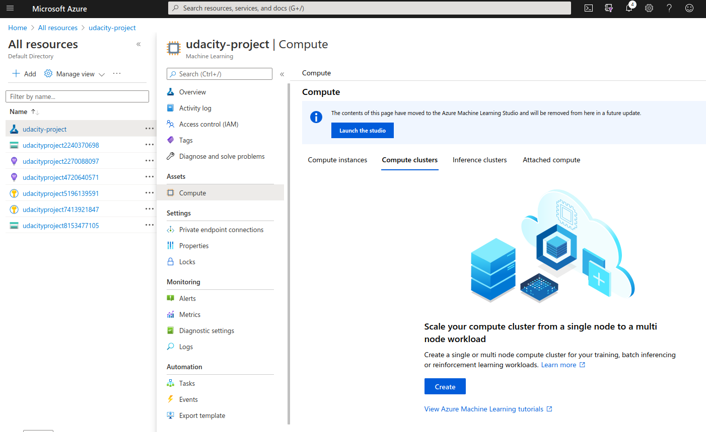

# Optimizing an ML Pipeline in Azure

## Overview
This project is part of the Udacity Azure ML Nanodegree.
In this project, we build and optimize an Azure ML pipeline using the Python SDK and a provided Scikit-learn model.
This model is then compared to an Azure AutoML run.

## Summary
**In 1-2 sentences, explain the problem statement: e.g "This dataset contains data about... we seek to predict..."**

We are working on the UCI Bank Marketing dataset. The dataset gives information about a marketing campaign of a bank.  The aim is to predict how likely the customer are to
subscribe to the product being advertised.

**In 1-2 sentences, explain the solution: e.g. "The best performing model was a ..."**

## Scikit-learn Pipeline
**Explain the pipeline architecture, including data, hyperparameter tuning, and classification algorithm.**
We used LogicRegression classifier provided by scikit-learn to train and test the data. The pipeline for scikit learn is:
- Get data using `TabularDatasetFactory` class using the url provided.
- Clean the data, extract the data and label into a different dataframe. This is done via the `clean_data` script provided in the starter code.
- Using Scikit Learn `train_test_split` split the data into the test and training samples.
- Setup hyperparameter tuning to determine the best possible value for two parameters of Logistic Regression classifier:
  - **C** : ``inverse of regularization strength`` Defines the regularization strength, smaller values means strong regularization. I have chosen a uniform range between 0.5 and 1.0. 
  - **max_iter** : The maximum number of iterations taken by the solver to converge. I have chosen three discrete values viz: 40, 100, and 150.
- I also setup the termination policy, I chose [BanditPolicy](https://docs.microsoft.com/en-us/python/api/azureml-train-core/azureml.train.hyperdrive.banditpolicy?view=azure-ml-py&preserve-view=true#&preserve-view=truedefinition) which is based on slack factor/slack amount. I specified a slack factor of 0.1. The `evaluation_interval` and `delay_evaluation` are set 1 and 5 respectively.   

**What are the benefits of the parameter sampler you chose?**
I used Random sampler for the hypertuning. The sampler allows one to chose parameter values from a set of discrete values or a distribution over a continous range. Since the two hyperparameters that I have selected are both continous (C) and discrete (max_iter) this is a natural choice. 

**What are the benefits of the early stopping policy you chose?**
BanditPolicy is used to stop the hyperparemeter tuning, it helps to stop the process when there is a considerable drop in
``Accuracy``(metric being checked against). In the experiment,  early termination policy is applied at every interval when metrics are reported, starting at evaluation interval 5. Any run whose best metric is less than (1/(1+0.2) or 91% of the best performing run is terminated.

## AutoML
**In 1-2 sentences, describe the model and hyperparameters generated by AutoML.**

For AutoML procedure the first intial steps were same in data pipeline:
 - Clear data
 - Split data to train test dataset.

 Next we created a config for AutoML, with **accuracy** as our primary metric. We also decided for cross validation to take care of any overfitting. That's all.

## Pipeline comparison
**Compare the two models and their performance. What are the differences in accuracy? In architecture? If there was a difference, why do you think there was one?**

* First in case of Hyperdrive only one model with different hyperparameters was searched, but AutoML worked with many other models as well.
* In Hyperdrive we have to build a training script, but in AutoML we just need to pass the data, and define the task.
* AutoML is easy to use, I got my AutoML working in first run, but for Hyperdrive, two days were spent.
* The best model using hyperdrive is LOgistic Regressor Classifier with C= 0.57, max_iter = 150, and accuracy = 91.4%. The AutoML gives us the best result for 91.9%.

## Future work
**What are some areas of improvement for future experiments? Why might these improvements help the model?**
Presently, I have not spent much time on data cleansing and feature engineering. I think the two can be explored to generate better results. Also as mentioned by Hyperdrive, the data is highly imbalanced, so strategies to deal with class imbalance should be done as well.

## Proof of cluster clean up
**If you did not delete your compute cluster in the code, please complete this section. Otherwise, delete this section.**
**Image of cluster marked for deletion**
The following is the image after the experiment was run-- there are no compute clusters present.

